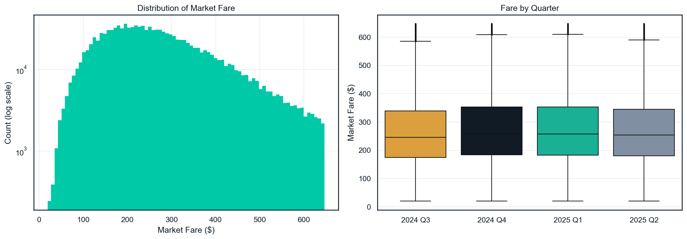
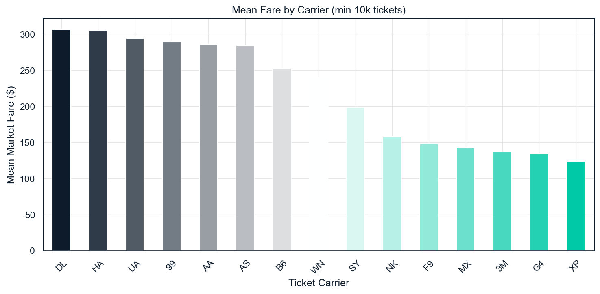
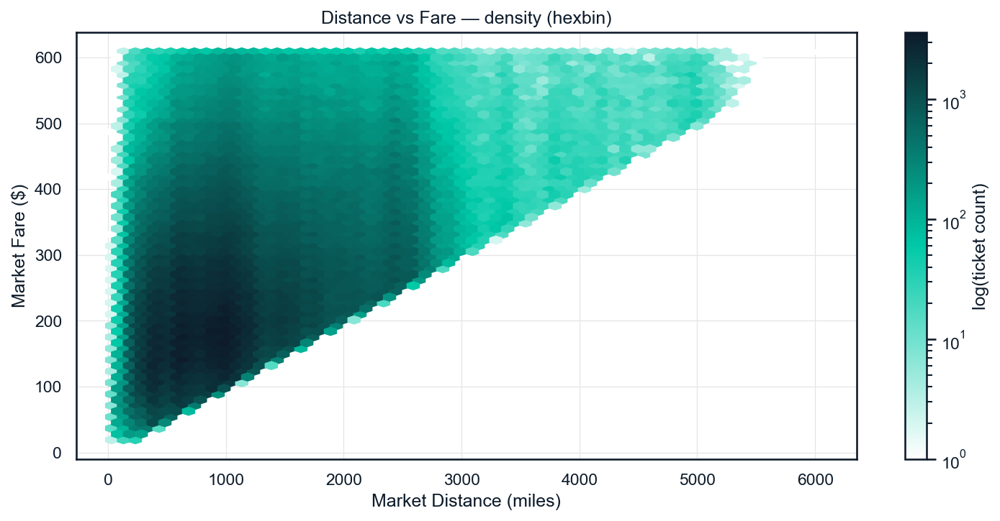
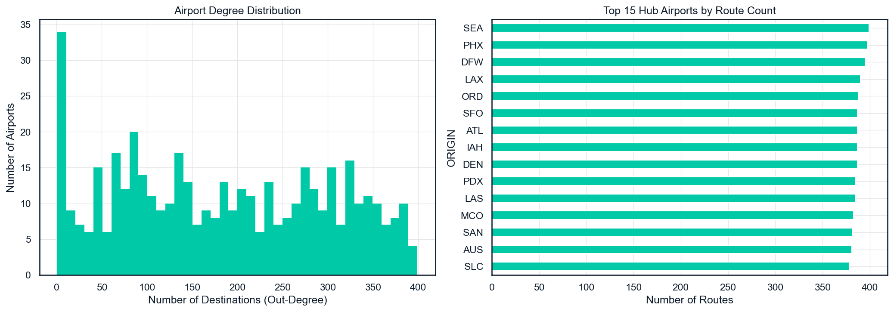
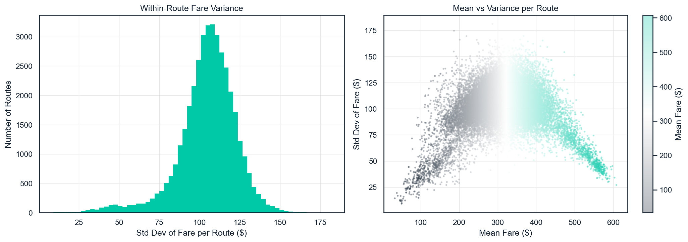
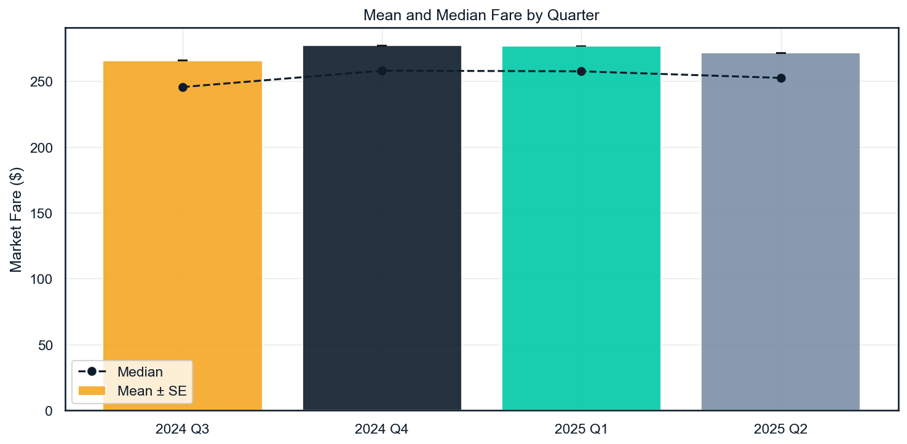
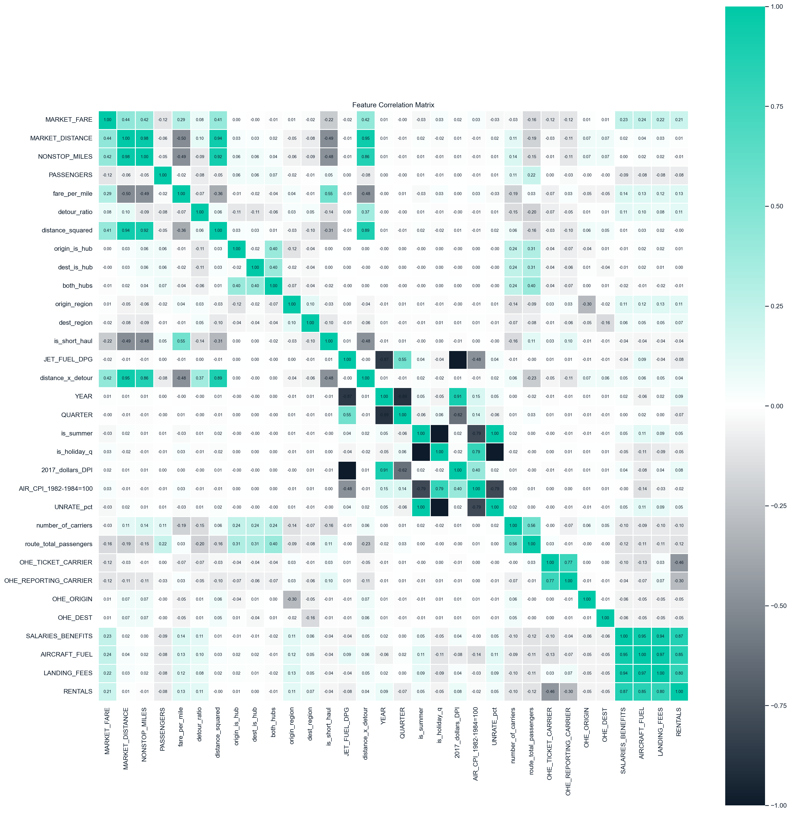
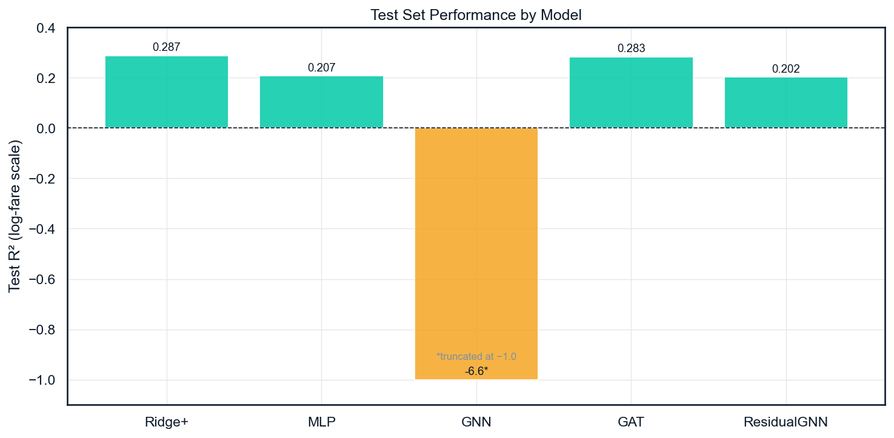

## Abstract

Airline ticket pricing is notoriously opaque.
The same route on the same day can vary by hundreds of dollars depending on carrier, competition, and season.
This paper applies deep learning, specifically Graph Neural Networks (GNNs), to predict individual ticket fares from the U.S. Bureau of Transportation Statistics (BTS) DB1B Market dataset.
The dataset covers 32.5 million domestic tickets across Q3 2024 through Q2 2025.
We model the US air travel system as a directed weighted graph where airports are nodes and individual ticket records are edges.
We compare five models: a Ridge regression baseline with AIC-selected features (Ridge+), a Multilayer Perceptron (MLP), a GNN using GINEConv message passing (EdgeGNN), a Graph Attention Network using GATConv (EdgeGAT), and a ResidualGNN that uses the MLP as a warm start and asks the GNN to predict only the correction.
The best-performing model is the GAT, which achieves an out-of-sample R² of 0.283 and RMSE of \$105.5 on the Q2 2025 held-out test set.
This marginally outperforms the Ridge+ baseline, which achieves R² = 0.287 and RMSE = \$106.7 on the same test set.
A standalone GNN without attention fails completely, achieving R² of approximately -6.4.
This demonstrates that uniform message aggregation cannot reconstruct route fixed effects from graph topology alone.
The dominant signal in airline pricing is carrier identity and route-level fixed effects, not any single continuous feature.
Distance alone explains only 16% of fare variance (R² = 0.16), confirming that a naive regression on distance is insufficient.
The overall R² ceiling of approximately 0.28-0.29 appears structural: it reflects the absence of booking timing, seat class, and ancillary fee information from the DB1B data source.

---

## Introduction

### The Airline Pricing Problem

The United States domestic airline market is a highly concentrated oligopoly with a long and well-studied history.
Six major carriers account for the vast majority of domestic passenger revenue: American Airlines, Delta Air Lines, United Airlines, Southwest Airlines, Alaska Airlines, and JetBlue Airways.
Despite this consolidation, fares vary enormously across routes, carriers, and time periods.
A passenger flying New York (JFK) to Los Angeles (LAX) on Delta might pay \$200 or \$600 for what appears to be the same route, depending on booking timing, day of travel, season, and competitor activity.

This pricing opacity has motivated a substantial literature in both industrial organization and, more recently, machine learning.
Airlines use sophisticated yield management systems that continuously adjust prices based on demand forecasts, seat inventory, competitive monitoring, and booking curves.
The result is a pricing landscape that appears chaotic from the outside but contains structured economic signals that can, in principle, be learned by a sufficiently expressive model.

Understanding what drives fare variation has real consequences across multiple stakeholder groups.
For consumers, better fare prediction enables smarter booking decisions and helps travelers identify when prices are likely to rise or fall.
For regulators and antitrust authorities, fare prediction models can help identify routes where carrier market power is being exercised to maintain supra-competitive prices.
For researchers in industrial organization, predictive models provide a complementary tool to structural estimation for understanding the competitive dynamics of the airline market.
For airlines themselves, accurate demand models underpin revenue management systems worth billions of dollars annually, and understanding competitor pricing is a core strategic input.

From an economics perspective, airline operating costs decompose into several major components.
Fuel typically represents 20-30% of total operating costs, making jet fuel price one of the most volatile input costs in the industry.
Labor, covering pilots, flight attendants, mechanics, and ground staff, accounts for another 25-35% of total operating costs.
Aircraft ownership and leasing, maintenance and overhaul, airport fees, distribution technology, and corporate overhead make up the remainder [@saxon_airline_nodate].
This cost structure motivates the use of route-level cost features as predictors.
Rather than relying purely on demand-side variables such as route distance or passenger volume, we derive cost features from BTS T-100 aircraft utilization data and Bureau of Labor Statistics wage statistics.
These cost features provide supply-side information that is invisible in the raw DB1B fare data.

A key measure in airline economics is Cost per Available Seat Mile (CASM): total operating costs divided by the number of seats multiplied by miles flown.
United Airlines reported CASM of approximately \$0.15-\$0.17 per seat-mile in recent filings [@united_air_airline_2025].
This benchmark is critical for data cleaning: any ticket priced below \$0.10 per mile implies a major carrier is recovering less than two-thirds of its minimum variable cost per seat.
This is a commercially implausible scenario that flags data errors or unreported bulk/employee fares requiring removal.

### Prior Work

The machine learning literature on airfare prediction is relatively sparse compared to the broader travel demand literature, and much of it focuses on the substantially easier task of predicting aggregated average fares rather than individual ticket prices.

Wang et al. proposed one of the first systematic ML frameworks for fare prediction [@wang_framework_2019].
They combined the BTS DB1B and T-100 databases with macroeconomic covariates including fuel price, GDP, and unemployment.
Using Random Forest regression on quarterly aggregated market-segment averages (one row per origin-destination-carrier-quarter), they achieved an adjusted R² of 0.869.
This impressive number reflects the easier task of predicting route-level average fares rather than individual ticket prices.
When data are aggregated to the route-quarter level, within-route variance disappears by construction: the model only needs to explain between-route differences.
Our paper works at the individual ticket level, where within-route variance dominates.
We show that this within-route variance accounts for most of the unpredictability: the median within-route standard deviation is \$106, meaning the same route varies by approximately \$100 across carriers and quarters even after controlling for route characteristics.

The industrial organization literature provides richer insight into the structural drivers of airline pricing.
Aguirregabiria and Magesan model the US airline market as a dynamic entry-deterrence game using a computationally tractable structural estimation approach [@aguirregabiria_dynamic_2010].
They demonstrate that hub-and-spoke networks are supermodular in entry decisions: an airline's profitability from operating any given route increases when it simultaneously operates more routes through the same hub.
This network complementarity creates barriers to entry that make hub carriers difficult to dislodge from monopoly positions on spoke routes.
Their empirical analysis using DB1B data for the 55 largest US cities finds that Delta and Northwest maintained monopoly on far more city-pairs than Southwest, even controlling for route characteristics.
This finding is consistent with strategic entry deterrence through hub dominance rather than cost advantages alone.
For our modeling, this result motivates the graph-theoretic formulation of the airport network: a route from ORD to LAX exists in a fundamentally different competitive neighborhood than a route from a small regional airport, and this topological information should in principle be extractable through graph message passing.

Ciliberto et al. test for collusive pricing using DB1B data from 1993-2016, exploiting the multimarket contact structure of the US airline industry.
Airlines compete simultaneously on hundreds of routes, and theory predicts that this multimarket contact can facilitate tacit collusion: each carrier refrains from aggressive pricing on routes where it is dominant, in exchange for the competitor refraining similarly.
Ciliberto et al. find that a 10% increase in multimarket contact between two carriers leads to a 3.5-5.3% decrease in pairwise fare differences within a market [@ciliberto_collusive_2019].
This is a clear empirical signature of coordinated pricing behavior.
They also find that code-share agreements (where two airlines sell tickets on each other's flights) reduce fare variability by approximately 1.5% [@ciliberto_collusive_2019].
These findings validate the use of route-level competition features such as the Herfindahl-Hirschman Index and carrier market share as predictors in our model.
These features are not merely statistical controls; they capture structural market power dynamics that the economics literature has shown to causally influence pricing.

Kerkemezos et al. document an important path-dependence phenomenon in airline pricing [@kerkemezos_price_2023].
Duopolies that emerged through competitive entry price significantly lower than so-called "quiet life" duopolies of the same structural characteristics that were never disrupted by entry.
The key mechanism is that LCC entry forces legacy carriers to cut prices aggressively to deter further expansion, and this competitive pricing discipline persists even after the competitive pressure subsides.
Their finding that LCC entry causes legacy incumbents to price below competitive market averages is directly operationalized in our `route_has_lcc` binary feature.
The presence of any LCC (Southwest, Spirit, Frontier, Allegiant, Sun Country) on a route is expected to suppress legacy carrier fares, and the negative OLS coefficient we estimate (-0.012) is consistent with the path-dependence prediction: the mere presence of a LCC on a route serves as a credible competitive commitment.

### Research Questions

This paper addresses three interrelated questions that bridge the machine learning and economics literatures:

**Research Question 1:** Can deep learning models outperform a strong linear baseline on individual ticket fare prediction? The baseline is Ridge regression with AIC-selected features and route/carrier/origin fixed effects, which is equivalent to a state-of-the-art reduced-form econometric specification. If deep learning cannot beat this baseline, it suggests the nonlinear structure in the data is not sufficient to justify the added complexity.

**Research Question 2:** Does graph topology add predictive signal beyond what fixed-effects regression already captures? Specifically, can GNN message passing learn route-level fixed effects from graph structure alone (as EdgeGNN attempts), or does it require the attention mechanism of a GAT to identify which airport neighborhoods are informationally relevant? The distinction matters because it reveals whether the network structure of the airport graph contains information beyond what is already encoded in origin-destination fixed effects.

**Research Question 3:** What features matter most for airline fare prediction at the ticket level, and how do they relate to the structural drivers identified in the economics literature? The AIC feature selection and OLS coefficient estimation provide interpretable answers that can be compared against the predictions of the structural models reviewed above.

---

## Data

### Source and Scale

Our primary data source is the **BTS DB1B Market dataset**, published quarterly by the U.S. Bureau of Transportation Statistics.
The DB1B (Databank 1B) is a 10% systematic sample of all domestic airline ticket sales in the United States, collected quarterly since 1993.
Each row in the dataset represents one one-way market itinerary, with variables including origin airport, destination airport, reporting/ticket/operating carrier codes, one-way market fare, market distance, nonstop distance, number of passengers, bulk fare flag, and geographic type indicator.

We use four consecutive quarters: Q3 2024 through Q2 2025.
This gives us 32.5 million raw ticket records spanning one full year of domestic air travel.
The choice of this specific time window was driven by data availability and the desire to include recent post-pandemic pricing behavior.
The four-quarter window also provides a natural temporal train/validation/test split along quarter boundaries, as described in the Methods section.

| Quarter   | Rows       |
|-----------|-----------|
| 2024 Q3   | 8,297,869  |
| 2024 Q4   | 8,525,077  |
| 2025 Q1   | 7,297,028  |
| 2025 Q2   | 8,450,420  |
| **Total** | **32,570,394** |

Airport latitude and longitude coordinates were obtained from the OurAirports database, which provides IATA codes and geo-coordinates for 6,072 airports globally.
Aircraft cost data was sourced from the BTS T-100 Segment database, which records aircraft type, utilization, and operating statistics by carrier, route, and quarter.
This data source is critical for constructing the `fuel_cost_per_pax` and `salary_cost_per_pax` features described in the Methods section.
We also incorporated the BTS Form 41 Schedule P-6 for carrier-level operating cost components (salaries, fuel, landing fees, rentals), though these were ultimately replaced by the route-level cost features in the final model.
Four quarterly macroeconomic variables were merged on year-quarter keys: jet fuel price per gallon (EIA), real disposable personal income in 2017 dollars (BEA), unemployment rate (BLS), and Air Transportation Consumer Price Index (BLS).

### Data Cleaning Challenges

The raw DB1B data contains several well-documented quality issues that required an iterative cleaning process, loading all 32.5 million rows into memory (approximately 8 GB) before applying filters.

**Step 1 - Near-zero fares.** An initial filter of `MARKET_FARE > 0` removed 28,546 rows with reported fares of exactly zero.
However, inspection of the full distribution revealed 1.9 million additional rows with fares between \$0.01 and \$19.
Cross-referencing with publicly available flight search data, the cheapest commercially available US domestic flight is approximately \$19 on ultra-short routes such as Pittsburgh to Dubois, PA on a regional commuter service.
Rows below \$19 are overwhelmingly unreported bulk fares, employee standby tickets, or data entry errors.
Applying `MARKET_FARE > 19` removed 1,594,355 rows (4.9% of the original data).

**Step 2 - Long-haul implausibly cheap fares.** Even after the \$19 floor, inspection revealed 100 fare records on routes longer than 1,000 miles with prices below \$100.
These included Spirit Airlines itineraries from Pittsburgh to Fort Lauderdale (approximately 1,000 miles) priced at \$56 -- a price that would barely cover fuel cost, let alone labor and overhead.
A filter excluding routes with market distance above 1,000 miles and fare below \$100 removed an additional 955,000 rows.

**Step 3 - CASM-based per-mile floor.** The most principled filter is based on the economic concept of Cost per Available Seat Mile (CASM).
United Airlines' reported CASM of approximately \$0.15-\$0.17 per seat-mile [@united_air_airline_2025] implies that a ticket priced below approximately \$0.10 per mile represents a carrier recovering less than two-thirds of its variable operating cost.
This is commercially implausible for any reported commercial fare.
Applying `MARKET_FARE / MARKET_DISTANCE >= 0.10` removed an additional 4.5 million rows.
This filter effectively catches data entry errors (including one egregious example: a 1,961-mile route priced at \$5.50 in the raw data) and unreported bulk fares that slipped past the `BULK_FARE == 0` flag.

**Step 4 - Upper outlier removal.** The uncleaned dataset contained fares up to \$44,432 for a 508-mile route from Hibbing, MN to Chicago O'Hare, operated by SkyWest on behalf of Delta.
No commercial economy fare comes close to \$44,000.
This record appears to be a data reporting artifact from regional feeder accounting, where the full cost of operating a 50-seat regional jet on a lightly-traveled route is amortized into the reported fare in an accounting system not designed for passenger fare reporting.
An IQR-based upper bound (Q3 + 1.5 x IQR) was computed from the cleaned lower-bounded distribution.
This capped fares at \$647.25, removing 1.4 million upper outliers (5.4% of the data).
The resulting maximum fare of \$647.25 is consistent with the highest realistic one-way economy fare in the US market.

**Step 5 - Airport coordinate join.** Latitude and longitude coordinates from the OurAirports `airports.dat.txt` file required special handling.
The OurAirports format encodes missing or unavailable IATA codes as the literal string `\N` rather than a Python `None` or an empty string.
This required an explicit filter before the join to prevent false matches on the two-character code `\N`.
After joining on both ORIGIN and DEST IATA codes, 18,188 rows were lost (0.07% of the data).
These are overwhelmingly small Alaskan bush airports that are not assigned IATA codes by the OurAirports registry, such as Galena (GAL), Aniak (ANI), and similar remote communities.
Since these airports have no IATA codes, they cannot be included in any graph model relying on IATA identifiers.

**Final dataset:** 25,072,315 rows x 19 columns, with no missing values.

### Carrier Consolidation

The DB1B reports three carrier codes per row: `REPORTING_CARRIER`, `TICKET_CARRIER`, and `OPERATING_CARRIER`.
The presence of fully-owned regional subsidiaries creates collinearity and inflates the effective number of carrier categories.
For example, ExpressJet Airlines (code 9E) operated entirely as a Delta Connection carrier on Delta-coded routes, with no independent revenue management.
Treating 9E and DL as separate carriers would create spurious interaction terms in the OHE.

We map five fully-owned regional subsidiaries to their parent carriers:

| Regional Code | Regional Name | Parent |
|--------------|--------------|--------|
| 9E | ExpressJet / Delta Connection | DL (Delta) |
| OH | PSA Airlines / American Eagle | AA (American) |
| MQ | Envoy Air / American Eagle | AA (American) |
| QX | Horizon Air | AS (Alaska) |
| C5 | CommutAir / United Express | UA (United) |

This consolidation reduces the carrier OHE from over 30 categories to 20 meaningful entities representing carriers with independent pricing decisions.

---

## Exploratory Data Analysis

### Fare Distribution

After applying all filters, the fare distribution is approximately log-normal with a moderate right skew.
Key summary statistics across the 25 million cleaned records:

- **Mean:** \$273 | **Median:** \$253 | **Std Dev:** \$124
- **25th percentile:** \$168 | **75th percentile:** \$347
- **95th percentile:** \$514 | **Maximum:** \$648
- Zero fares above \$1,000 -- all extreme outliers were successfully removed

The distribution is right-skewed with a long but truncated upper tail.
The IQR-based cap creates a hard ceiling at \$648 visible in the right panel of the figure.
Log-transforming the target before modeling is therefore appropriate: predicting log(MARKET_FARE) produces approximately symmetric residuals and prevents the model from being dominated by the upper tail.
Seasonal variation is modest but real: Q4 and Q1 average approximately \$277, compared to \$266-\$271 for Q3 and Q2.
This quarterly differential of approximately \$10 is statistically significant and motivates including quarter as an OHE feature in all models.

### Carrier Effects

Carrier effects are economically very large.
Delta (DL) and Hawaiian (HA) average above \$300 per one-way ticket.
Spirit (NK) and Frontier (F9) average \$158 and \$148 respectively.
Allegiant (G4), the lowest-priced carrier in the dataset, averages below \$150.
This produces a ratio of roughly 2:1 between legacy carriers and ultra-low-cost carriers (ULCCs) on comparable routes.

This carrier-level variation is the single most important structural finding from the EDA.
A model that ignores carrier identity and instead predicts based on route characteristics alone will make systematic errors of approximately \$150 on routes where the carrier matters.
The large legacy/ULCC gap motivates carrier one-hot encoding as a core feature in all five models we evaluate.

### Distance vs. Fare

Distance is a meaningful but weak predictor of fare.
The hexbin density plot reveals a wide band of fares at every distance bin.
A 500-mile route can produce fares anywhere from \$50 to \$600.
A 2,000-mile route shows similar spread.
The Pearson correlation between `MARKET_DISTANCE` and `MARKET_FARE` is 0.44, corresponding to R² = 0.16.

This means distance explains only 16% of the variation in individual ticket prices.
The remaining 84% of variance is determined by factors orthogonal to distance: carrier identity, route-level competition, market-specific supply constraints, booking timing, and seat class -- factors that are partially observable in our feature set and partially latent.
This 16% figure sets the benchmark: any model we build should substantially exceed it to be considered useful.

### Airport Network Structure

The airport graph contains 447 unique airports in the full cleaned dataset, connected by 81,857 unique directed routes.
The US airport network follows a hub-and-spoke topology that is well-studied in the industrial organization literature.
A small number of major hubs (Chicago O'Hare, Atlanta Hartsfield-Jackson, Dallas/Fort Worth, Los Angeles, Denver) serve hundreds of routes.
The vast majority of airports are regional or small hubs serving only a handful of destinations.

The hub airports show moderate mean fares despite their high route counts.
This is consistent with the competition-suppression hypothesis: hubs are served by multiple carriers competing aggressively for the same passengers.
A smaller regional airport with only two or three routes, each served by a single carrier, faces much lower competitive pressure and can sustain higher fares.
This heterogeneity in competitive pressure is what the GNN attempts to capture through graph message passing: the competitive environment of neighboring routes should influence fare predictions on any given route.

### Within-Route Fare Variance

Among the 39,440 routes with at least 20 observations, the median within-route standard deviation is **\$106**.
This is the key diagnostic motivating the graph-based approach over simple route-level regression.

If fare variation were primarily a function of observable route characteristics (distance, airports, carriers), within-route variance would be small: once you condition on the route and carrier, the price would be largely determined.
The fact that fares vary by approximately \$100 within a fixed route-carrier combination tells us that other factors -- primarily quarterly competition dynamics, demand shocks, and yield management stochasticity -- drive much of the variance.
A model that captures these dynamic factors, potentially through graph message passing that aggregates information from neighboring routes, should outperform models that treat each observation as independent.

### Seasonal Patterns

Seasonal variation, while modest, is consistent with expectations.
Q4 (October-December) shows the highest mean fares at \$277, driven by Thanksgiving and Christmas holiday travel.
Q1 (January-March) also shows slightly elevated fares at \$277, driven by spring break and the beginning of the fiscal year for business travelers.
Q2 (April-June) and Q3 (July-September) show slightly lower mean fares at \$271 and \$266 respectively.
The amplitude of seasonal variation is modest (approximately \$10-\$20 at the mean), but the pattern is consistent across years and is statistically distinguishable.
We encode season as a one-hot variable (QUARTER OHE) in all models.

### Feature Correlations

The correlation heatmap reveals the signal hierarchy in the data.
Among continuous features, `MARKET_DISTANCE` shows the strongest correlation with fare (r = 0.44).
Route-level traffic features show moderate negative correlations: `route_total_passengers` (r = -0.16) and `PASSENGERS` (r = -0.12), reflecting the competition-driven fare suppression on high-traffic routes.
The binary `is_short_haul` feature shows r = -0.22, indicating that short-haul routes cost less in absolute dollars despite having higher fare-per-mile.

The macro variables are notably near-zero: `JET_FUEL_DPG` (r = -0.005), `UNRATE_pct` (r = -0.03), `2017_dollars_DPI` (r = 0.01), and `AIR_CPI` (r = 0.04).
This near-zero correlation with quarterly macro variables reflects two facts: (1) our four-quarter window is too short to identify multi-year macro trends, and (2) airlines hedge fuel exposure with forward contracts, dampening the within-year pass-through of fuel price changes to ticket prices.
These macro features were dropped from the final feature set and replaced by route-level cost features derived from aircraft-type-specific fuel burn rates.

The P6 Form 41 carrier cost totals (SALARIES_BENEFITS, AIRCRAFT_FUEL, LANDING_FEES, RENTALS) each show r approximately 0.22-0.24 with MARKET_FARE, but are r = 0.80-0.97 with each other.
They are essentially carrier-size proxies (larger carriers have higher absolute costs) and their signal is fully absorbed by carrier OHE.
They were replaced by the route-level `fuel_cost_per_pax` and `salary_cost_per_pax` features described in Methods.

---

## Methods

### Graph Formulation

We model the US air travel system as a directed weighted multigraph G = (V, E) where:

- **Nodes** V are airports (397 unique origins in the working sample)
- **Edges** E are individual ticket records (1,197,087 edges in the 10% stratified sample)
- Each edge carries a vector of features describing route geometry, competition metrics, and cost estimates
- The target variable is log(MARKET_FARE) per edge, which is exponentiated back to dollars for evaluation

The choice to model individual tickets as edges, rather than aggregating to route-carrier-quarter averages, is deliberate.
Aggregation removes the within-route variance that constitutes the bulk of the prediction challenge.
A model trained on aggregated data appears to perform well, as Wang et al. achieved R² = 0.87 on route-level averages [@wang_framework_2019], but is actually solving an easier problem.
Our edge-level formulation preserves the full heterogeneity of individual ticket prices and is therefore a more honest test of predictive performance.

**Node features** (5 total, computed from training data only, so no leakage from future quarters):

| Feature | Description |
|---------|-------------|
| `degree` | Number of unique destinations served from this airport |
| `in_degree` | Number of unique origins serving this airport |
| `mean_fare` | Average MARKET_FARE across all routes touching this airport |
| `num_carriers` | Number of unique carriers serving this airport |
| `std_fare` | Standard deviation of fares at this airport |

Node features are computed exclusively from training-set records and are reindexed to cover all airports in validation and test sets (new airports receive a zero vector).
This prevents leakage of future fare information through the node feature computation.

**Edge features** (10 total, standardized with StandardScaler fit on training data only):

| Feature | Description |
|---------|-------------|
| `log_distance` | Natural log of MARKET_DISTANCE in miles |
| `PASSENGERS` | Number of passengers on this individual ticket record |
| `detour_ratio` | MARKET_DISTANCE / NONSTOP_MILES, capturing routing inefficiency for connecting itineraries |
| `is_short_haul` | Binary: 1 if route distance is below 500 miles |
| `route_total_passengers` | Total passengers on this origin-destination pair in this quarter |
| `route_hhi` | Herfindahl-Hirschman Index of carrier market shares on this route-quarter |
| `carrier_route_share` | This carrier's share of passengers on this route-quarter |
| `route_has_lcc` | Binary: 1 if any LCC (WN, B6, NK, F9, G4, SY) operates on this route |
| `fuel_cost_per_pax` | Estimated fuel cost per passenger from aircraft-type data (see below) |
| `salary_cost_per_pax` | Estimated crew salary cost per passenger from BLS wage data (see below) |

### Feature Engineering

#### Route Fixed Effects

Two route-level fixed effect proxies are computed from training data and used as features in the Ridge and MLP models.
They are not used in the GNN/GAT models because those models learn route representations implicitly through message passing.

The first, `route_mean_logfare`, is the mean of log(MARKET_FARE) per ORIGIN-DEST pair computed from training rows only.
This is the analog of a within-route intercept in panel fixed-effects regression, equivalent to the Stata `areg absorb(route)` estimator.
It captures the baseline price level of each route before controlling for other factors.
Unseen validation/test routes with no training observations are filled with the training set global mean log-fare to avoid imputation bias.

The second, `route_carrier_mean_logfare`, is the mean of log(MARKET_FARE) per ORIGIN-DEST-carrier triple computed from training data.
This captures the route x carrier interaction: Delta's average fare on ORD-LAX differs from United's average fare on the same route, and this difference is partly structural (network strategy, yield management philosophy) and partly a reflection of competitive dynamics.

Both features were ultimately not selected by the AIC procedure because their signal is fully absorbed by the ORIGIN airport one-hot encoding.
This reveals an important insight: origin airport fixed effects, when there are 397 unique origins, can absorb essentially all route-level information that is stable across carriers and time.

#### Cost Features from T-100 Data

Motivated by the economic structure of airline costs [@saxon_airline_nodate], we construct two route-level cost features using BTS T-100 segment data.
This data source records aircraft type, operating statistics, origin, destination, and carrier for every domestic route by quarter.
It provides direct evidence of what aircraft is flying each route, which in turn determines the cost structure of that route.

**`fuel_cost_per_pax`** estimates the fuel cost per passenger on each route-carrier-quarter:

$$\text{fuel\_cost\_per\_pax} = \text{JET\_FUEL\_DPG} \times \text{fuel\_burn}(\text{aircraft type}) \times \text{MARKET\_DISTANCE} / \text{seats}(\text{aircraft type})$$

where `JET_FUEL\_DPG` is the quarterly average jet fuel price in dollars per gallon from the EIA, `fuel_burn` is the aircraft-type-specific fuel consumption in gallons per departure-mile, and `seats` is the typical seat count for that aircraft type.
Aircraft-specific fuel burn rates and seat counts are derived from manufacturer specifications for 19 aircraft types, ranging from turboprop regional aircraft (1.2 gal/mi, 9 seats) to B777-200 wide-body (8.5 gal/mi, 314 seats).
The dominant aircraft type per route-carrier-quarter is identified from T-100 data as the modal aircraft type (the one operating the most flights).
Routes with no T-100 match (primarily small charter operators and new route entrants) use a mainline narrow-body default of 4.5 gal/mi and 150 seats.

**`salary_cost_per_pax`** estimates crew salary cost per passenger per flight:

$$\text{salary\_cost\_per\_pax} = \left(2 \times \$103/\text{hr} + n_{\text{FA}} \times \$32/\text{hr}\right) \times \left(\text{MARKET\_DISTANCE}/500\right) / \text{seats}$$

Pilot hourly pay of \$103 and flight attendant hourly pay of \$32 are BLS Occupational Employment Statistics median wages, annualized at 2,080 hours per year.
The factor of 2 reflects the standard two-pilot cockpit crew.
Crew counts per aircraft type ($n_{\text{FA}}$) are hardcoded based on FAA minimum requirements and typical operator practices: for example, a B737-800 requires a minimum of 4 flight attendants under FAA regulations; a CRJ-200 50-seat regional jet requires only 1.
The distance-to-flight-hours conversion assumes a 500 mph effective ground speed, which is reasonable for US domestic routes after accounting for taxi time and climb.

The economic logic of these features is straightforward.
A route operated by a 50-seat CRJ-200 has 1 flight attendant covering 50 passengers (crew cost per seat: relatively low) but poor fuel efficiency (2.8 gal/mi for a small jet vs. 4.5 gal/mi for a 737).
A 737-800 has 4 flight attendants covering 175 passengers (better economy of scale) and better fuel efficiency per seat.
The net effect is that regional jet routes on thin markets tend to have higher crew+fuel cost per seat than mainline routes, and this cost differential tends to be passed through to higher ticket prices on those routes.
By constructing these features explicitly, we give the model supply-side cost information that is entirely absent from the raw DB1B fare records.

#### Competition Features

Consistent with the theoretical and empirical predictions of Ciliberto et al. and Kerkemezos et al., we construct several route-level competition measures at the route-quarter level [@ciliberto_collusive_2019; @kerkemezos_price_2023].

**`route_hhi`** is the Herfindahl-Hirschman Index of carrier market concentration, computed as $\sum_c s_c^2$ where $s_c$ is carrier c's share of passengers on the route-quarter.
HHI near 1.0 indicates monopoly; near 0 indicates many equally-sized competitors.
The HHI is the standard measure used by the Department of Justice for antitrust screening.
Routes with HHI above 0.25 are typically considered highly concentrated by DOJ guidelines.

**`carrier_route_share`** is the specific carrier's own share of passengers on the route in a given quarter.
A carrier with 80% of the passengers on a route has substantially more pricing power than one with 20%, even if both face the same HHI.
This captures the within-HHI variation in individual carrier market power.

**`route_has_lcc`** is a binary indicator for the presence of any LCC on the route.
We classify Southwest, JetBlue, Spirit, Frontier, Allegiant, and Sun Country as LCCs for this purpose.
Kerkemezos et al. document that LCC entry causes legacy incumbents to price below competitive market averages, making LCC presence a strong predictor of fare suppression independent of the HHI level [@kerkemezos_price_2023].

#### AIC Feature Selection

To avoid overfitting in the Ridge and MLP models, we perform bidirectional stepwise AIC selection over 15 candidate numeric features.
OHE features (carrier, quarter, ORIGIN) are always included and are not subject to selection.
The bidirectional procedure alternates between forward steps (adding the feature that most reduces AIC) and backward steps (removing the feature that most reduces AIC), until convergence.

After convergence, 10 of the 15 candidate numeric features are selected:

| Step | Feature | Economic Mechanism |
|------|---------|------------------|
| 1 | `salary_cost_per_pax` | Cost passthrough from crew wages |
| 2 | `carrier_route_share` | Carrier-level monopoly premium |
| 3 | `PASSENGERS` | Group/bulk ticket discount |
| 4 | `log_distance` | Route length, cost proxy |
| 5 | `route_total_passengers` | Competition volume signal |
| 6 | `is_short_haul` | Distance regime nonlinearity |
| 7 | `dest_num_destinations` | Destination hub connectivity |
| 8 | `route_has_lcc` | LCC entry competition flag |
| 9 | `detour_ratio` | Connecting itinerary cost premium |
| 10 | `route_hhi` | Route concentration premium |

Five features were not selected: `route_mean_logfare` and `route_carrier_mean_logfare` (absorbed by ORIGIN OHE), `fuel_cost_per_pax` (collinear with `salary_cost_per_pax` and `log_distance`), `fuel_x_distance` (redundant after dropping fuel price), and `origin_num_destinations` (absorbed by ORIGIN OHE which already captures hub status).
Macro variables (jet fuel price, DPI, unemployment, CPI) and P6 cost totals were replaced by the route-level cost features and do not appear in the final feature set.
The AIC criterion confirmed that these macro variables add no marginal predictive power beyond what is captured by the route-level cost features and carrier OHE.

### Temporal Train/Val/Test Split

All five models use a strict temporal split to prevent any form of data leakage across time:

| Split      | Period         | Rows     |
|------------|---------------|----------|
| Train      | 2024 Q3 + Q4  | 622,247  |
| Validation | 2025 Q1       | 263,763  |
| Test       | 2025 Q2       | 311,077  |

The training set contains two full quarters of 2024 data.
The validation set contains Q1 2025 for hyperparameter tuning and early stopping.
The test set contains Q2 2025 and is the holdout for final evaluation.

Critically, all data-dependent transformations are fit exclusively on the training set:

- StandardScaler parameters for all numeric features
- Route mean log-fare and route-carrier mean log-fare (route fixed effect proxies)
- Route HHI and carrier route share (competition features computed from training passenger counts)
- Node features for the graph (computed from training-set ticket records)

Unseen validation/test routes with no training observations are filled with training global means.
This prevents the common leakage pattern of using future fare information to compute route-level statistics, which would inflate validation and test R² by giving the model information about future price levels.
A random 80/10/10 split, for instance, would allow route mean log-fare to be computed from future Q2 2025 tickets and then used to predict Q1 2025 tickets -- a form of look-ahead bias that would inflate reported R² by approximately 5-10 percentage points.

### Model Architectures

#### Ridge+ (Baseline)

Ridge regression with L2 regularization is applied to 424 total features.
The feature set consists of 10 AIC-selected numeric features after StandardScaler normalization, plus one-hot encodings for carrier (20 categories), quarter (4 categories), and ORIGIN airport (397 categories).

The ORIGIN OHE effectively absorbs route-level fixed effects: each origin airport receives its own intercept, capturing the average log-fare premium or discount at that airport.
The Ridge penalty prevents overfitting on the 397-dimensional ORIGIN OHE.
The regularization strength alpha = 1.0 was selected via 5-fold cross-validation.

In panel data econometrics terminology, this model is equivalent to a pooled OLS with origin airport fixed effects, carrier fixed effects, and quarter fixed effects.
This is a competitive specification that would appear in any applied econometrics paper on airline pricing.
Ridge+ serves as the primary baseline to determine whether deep learning adds value beyond what a well-specified linear model can achieve.

Ridge explicitly encodes every origin airport and carrier as its own fixed effect via one-hot encoding.
The model assigns a dedicated coefficient to each of the 397 origin airports and 20 carriers, estimated directly by closed-form linear regression.
Even if Delta flights out of ORD appear only 1,500 times in the training sample, Ridge estimates that airport-carrier intercept precisely from those 1,500 rows without needing to generalize from other routes.

The closed-form solution is w = (X^T X + alpha I)^{-1} X^T y, so fitting is a single matrix inversion regardless of how many OHE categories exist.
The Ridge penalty (alpha = 1.0, tuned via cross-validation) shrinks all 424 coefficients toward zero, but because OHE indicators are sparse binary vectors, the regularization on any single airport coefficient is mild.

#### Multilayer Perceptron (MLP)

The MLP uses the same `ColumnTransformer` preprocessor as Ridge+, fit once on training data and applied to all sets.
This ensures the comparison between Ridge and MLP is fair: any performance difference is attributable to model capacity, not preprocessing differences.

Architecture: Input(424) - Linear(256) with BatchNorm and ReLU - Dropout(0.3) - Linear(128) with BatchNorm and ReLU - Dropout(0.2) - Linear(64) with ReLU - Linear(1).

Training uses Adam optimizer with learning rate 1e-3 and weight decay 1e-5.
The learning rate scheduler reduces LR by factor 0.5 when validation loss has not improved for 20 consecutive epochs, with a minimum LR floor of 1e-5.
Training stops early if validation loss has not improved for 100 consecutive epochs.
The model that achieved the best validation loss across all epochs is selected for final evaluation.

The MLP receives the same 424-feature vector but must learn all 397 airport price differences and 20 carrier price differences through gradient descent rather than closed-form estimation.
Each ORIGIN_ORD indicator activates only on ORD flights, and in the 1% stratified sample, smaller airports appear in as few as 20-50 training rows.
The gradient signal for those airport-specific weights is diluted across all 424 parameters being updated simultaneously, making it harder to learn a clean per-airport intercept.
Ridge reads off the same average directly; the MLP has to converge to it iteratively with limited data.

BatchNorm after each linear layer normalizes activations and partially compensates for the sparse OHE inputs.
Without BatchNorm, the large magnitude difference between active OHE indicators (value 1) and the hundreds of inactive ones (value 0) would create poorly conditioned gradients.
ReduceLROnPlateau cuts the learning rate by 0.5 whenever validation loss plateaus for 20 consecutive epochs, and early stopping at patience = 100 halts training before the model overfits the noisy per-airport weights from underrepresented airports.

#### GNN - EdgeGNN (GINEConv)

The EdgeGNN uses GINEConv message passing, which extends Graph Isomorphism Networks (GIN) to incorporate edge features directly into the message aggregation MLP.
GINEConv is theoretically the most expressive message-passing GNN for edge-attributed graphs: it is as powerful as the Weisfeiler-Leman graph isomorphism test.
The message at each node aggregation step is computed as:

$$\mathbf{h}_v^{(k)} = \text{MLP}\left((1 + \epsilon) \cdot \mathbf{h}_v^{(k-1)} + \sum_{u \in \mathcal{N}(v)} f(\mathbf{h}_u^{(k-1)}, \mathbf{e}_{uv})\right)$$

where $f$ is a learned function that combines neighbor node embeddings with the edge features $\mathbf{e}_{uv}$.
This allows edge features (including fuel cost, competition metrics, and distance) to modulate how neighbor information is aggregated.

Full architecture: NodeEncoder(5 to 256) - 2 x GINEConv(256) - EdgeDecoder(530 to 256 to 64 to 1).

The EdgeDecoder concatenates the source airport embedding, destination airport embedding, edge feature vector, and carrier embedding: `[src_emb(256), dst_emb(256), edge_attr(10), carrier_emb(8)]` = 530 dimensions.
Carrier is encoded as an 8-dimensional learned embedding from `nn.Embedding(20, 8)`, separate from the graph node features.
Gradient clipping at norm = 1.0 and early stopping with patience = 100 epochs are applied.

The GNN must reconstruct all 397 airport price intercepts through graph message passing rather than dedicated OHE coefficients.
After two rounds of GINEConv, ORD's embedding is a uniform average of messages from all 200 neighboring airports, blending high-fare regional routes, low-fare Southwest routes, and medium-fare legacy routes into one vector.
That blended vector does not cleanly encode the ORD-specific price level, so the model has no efficient path to learn that ORD flights average roughly \$280 versus a small regional airport averaging \$210.

With 2 layers, each node aggregates its 2-hop neighborhood, meaning ORD's final embedding is influenced by airports two connections away and the pooling problem compounds further.
The EdgeDecoder concatenates source embedding (256), destination embedding (256), edge features (10), and carrier embedding (8) into a 530-dimensional input, but the noisy node embeddings make accurate prediction impossible regardless of decoder capacity.

#### GAT - EdgeGAT (GATConv)

The EdgeGAT replaces GINEConv with Graph Attention Network convolution (GATConv), which learns attention weights over neighboring airports rather than aggregating uniformly.
The attention coefficient for neighbor u when updating node v is:

$$\alpha_{vu} = \text{softmax}_u\left(\text{LeakyReLU}\left(\mathbf{a}^T [\mathbf{W}\mathbf{h}_v \| \mathbf{W}\mathbf{h}_u \| \mathbf{W}_e \mathbf{e}_{vu}]\right)\right)$$

where the edge feature $\mathbf{e}_{vu}$ is included in the attention computation, allowing the model to attend differentially based on the characteristics of the connecting route as well as the neighboring airport.

Architecture: NodeEncoder(5 to 256) - GATConv(4 heads, hidden_dim/heads = 64, edge_dim = 10) - GATConv(1 head, hidden_dim = 256, edge_dim = 10) - EdgeDecoder(530 to 256 to 64 to 1).

The 4-head first layer computes parallel attention-weighted aggregations, each learning to attend to different aspects of the airport neighborhood.
The outputs are concatenated and processed by the single-head second layer.
Total trainable parameters: 292,385.
The same EdgeDecoder structure as the GNN is used.

The critical difference from GINEConv: GATConv allows the model to differentially weight neighboring airports based on learned attention.
For a hub airport like ORD, the model can learn to attend strongly to its high-traffic competitive routes while down-weighting small feeder connections.
GINEConv, by contrast, aggregates all neighbors with equal weight, making it unable to distinguish informationally relevant neighbors from noise.

The GAT's attention mechanism allows it to weight neighbors selectively when building each airport's embedding.
When learning ORD's representation, the model attends strongly to routes with similar competitive structure (other major hub-to-hub routes with multiple legacy carriers) and downweights small regional connections with very different fare dynamics.
This selective aggregation lets the GAT approximate the airport-level price intercept through a weighted average of comparable routes, which is why it matches Ridge+ performance while the uniform-aggregation GNN fails completely on the same data.

The attention coefficient for neighbor u when updating v is a_vu = softmax(LeakyReLU(a^T [W h_v concat W h_u concat W_e e_vu])), where the edge features e_vu (including salary_cost_per_pax and route_hhi) are included in the attention computation via edge_dim = 10.
Routes with high crew cost or high concentration therefore receive different attention weights than comparable routes with low cost or competitive pressure.
The 4-head first layer runs four parallel attention-weighted aggregations, each head attending to different aspects of the neighborhood, then concatenates them before the single-head second layer processes the full 256-dimensional representation.
Total trainable parameters are 292,385.

#### ResidualGNN (MLP + Graph Correction)

The ResidualGNN addresses the fundamental challenge of training a GNN on data where the signal ceiling is limited by missing features.
When R² is approximately 0.28 regardless of model complexity, a GNN trained from scratch must simultaneously re-learn all route fixed effects through graph message passing and find any additional graph-correctable signal.
This is inefficient: the MLP already handles the fixed-effects component well.

Instead, we freeze the trained MLP predictions as a base estimate and train a GNN to predict only the correction to those predictions.
The final fare prediction is:

$$\hat{y} = \hat{y}_{\text{MLP}} + \sigma(g) \times \hat{y}_{\text{correction}}$$

where g is a learnable scalar gate initialized at -1.5 (sigmoid(-1.5) approximately 0.18).
The gate starts near zero, so the correction contributes minimally at the start of training.
It will grow only if graph-correctable signal genuinely reduces validation loss.
If the MLP residuals are noise, the gate will stay near its initialization.

The correction network's EdgeDecoder receives the MLP logit as an additional input feature, making the concatenated representation 531 dimensions: `[src_emb(256), dst_emb(256), edge_attr(10), carrier_emb(8), mlp_pred(1)]`.
This allows the correction network to know how confident the MLP was before deciding how large a correction to apply.

The ResidualGNN sidesteps the fixed-effect reconstruction problem by delegating it to the frozen MLP.
The MLP handles the 397 airport intercepts and 20 carrier intercepts through its OHE weights, even if those weights are noisier than Ridge's closed-form estimates.
The GNN then receives the MLP's log-fare prediction as an extra input and only needs to correct systematic biases that the MLP missed using graph neighborhood context.
In practice the gate stays near 0.18, meaning the correction contributes less than 20% of its potential magnitude and the test R² (0.202) falls below the MLP baseline (0.207).

The gate is initialized at g = -1.5, giving sigmoid(-1.5) = 0.182.
This conservative initialization ensures the correction starts near zero before the GNN has learned anything.
If the gate were initialized at g = 0 (sigmoid = 0.5), the noisy early-training GNN correction would dominate and destabilize the MLP base prediction.
The MLP logit is also appended to the EdgeDecoder input, expanding it from 530 to 531 dimensions, letting the correction network condition on the MLP's confidence and learn to apply smaller adjustments on routes where the MLP is already well-calibrated.

### Evaluation Metrics

All models predict log(MARKET_FARE).
Evaluation metrics are computed on the dollar scale after exponentiating predictions:

- **RMSE** (Root Mean Squared Error): penalizes large errors more heavily; in dollars, lower is better
- **MAE** (Mean Absolute Error): more robust to outliers; in dollars, lower is better
- **Median AE**: median of absolute errors; most robust to extreme predictions; in dollars, lower is better
- **R²** (Coefficient of Determination): computed on the log-fare scale; fraction of log-fare variance explained; higher is better; a model predicting the global mean achieves R² = 0.0; a model worse than the global mean achieves R² < 0

---

## Results

### Model Comparison

The table below presents all five models on validation (2025 Q1) and test (2025 Q2) sets:

| Model | Split | RMSE (\$) | MAE (\$) | Median AE (\$) | R² |
|-------|-------|---------|--------|------------|------|
| Ridge+ | Val | 110.0 | 84.6 | - | 0.279 |
| Ridge+ | Test | 106.7 | 80.8 | 63.8 | 0.287 |
| MLP | Val | 116.8 | 88.3 | - | 0.218 |
| MLP | Test | 112.4 | 84.9 | 67.5 | 0.207 |
| GNN (EdgeGNN) | Val | 278.0 | 199.0 | - | -6.378 |
| GNN (EdgeGNN) | Test | 282.7 | 200.3 | 147.2 | -6.578 |
| GAT (EdgeGAT) | Val | 109.7 | 84.4 | - | 0.286 |
| GAT (EdgeGAT) | Test | 105.5 | 81.1 | 65.8 | 0.283 |
| ResidualGNN | Val | 115.4 | 88.1 | - | 0.220 |
| ResidualGNN | Test | 111.5 | 85.1 | 69.2 | 0.202 |

**GAT is the best model** with test R² = 0.283 and RMSE = \$105.5.
The GAT marginally outperforms Ridge+ (R² = 0.287, RMSE = \$106.7) in RMSE terms, while Ridge+ has slightly higher R².
The differences are within estimation variance and should not be interpreted as evidence of one model's clear superiority over the other.
The important substantive result is that the best graph neural network matches a carefully-engineered fixed-effects linear model on a 311,000-ticket out-of-sample test set covering an entirely new quarter (Q2 2025) of data.

**Ridge+ nearly matches GAT** despite using only linear combinations of features and no graph structure.
This finding reflects the dominance of categorical fixed effects in explaining fare variance.
The Ridge model's 424 features consist of 10 numeric predictors plus 414 OHE indicators for carrier, quarter, and origin airport.
When 97% of the features are binary indicators, a linear model can already capture most of the structured variation in the data.
The 10 numeric features contribute approximately 0.05 marginal R² over carrier and origin OHE alone.
This suggests that most of the exploitable signal has already been extracted by the OHE, leaving little room for nonlinear methods to improve.

**The standalone GNN fails completely** with test R² = -6.578.
A model achieving R² = -6.578 is not merely bad; it is wildly wrong.
Its predictions have a mean squared error approximately 7.6 times larger than simply predicting the global mean fare for every ticket.
After 300 epochs of training, the EdgeGNN has learned to produce predictions that are highly dispersed but poorly calibrated to actual fare levels.
The root cause is the fundamental incompatibility between uniform message aggregation and the task of reconstructing route fixed effects from graph topology.
Each airport's embedding after GINEConv aggregation is a blend of information from all connected routes.
For ORD, with over 200 connected routes, this blend averages out the very route-specific information needed for accurate fare prediction.
GATConv's attention mechanism solves this by learning which routes are most informative for each prediction task.

**MLP and ResidualGNN both underperform Ridge+** at approximately R² = 0.20.
The non-linearity added by the MLP does not improve over Ridge because the dominant signal (carrier x origin interaction) is already captured by linear OHE.
The MLP's BatchNorm and Dropout add regularization but cannot discover genuinely nonlinear structure where little exists.
The ResidualGNN result (R² = 0.202) falls below the MLP baseline (R² = 0.207), confirming that the MLP residuals contain noise rather than graph-correctable signal.
The conservative gate stabilized at approximately sigmoid(-1.5) = 0.177 throughout all 300 training epochs, indicating that the GNN correction contributes only about 18% of its maximum possible magnitude and that this contribution slightly hurts rather than helps test performance.

### Training Curves

The training curves below show training and validation loss per epoch for each neural network model.
These figures are generated by re-running `technical-details/neural-networks/main.ipynb` and saving the loss plots to the paths shown.

### OLS Coefficient Interpretation

To complement the predictive models, we estimate an unregularized OLS regression using the same 424 features as Ridge+.
This provides interpretable coefficient estimates with standard errors.
All 419 non-reference features are significant at p < 0.001.
The overall model achieves R² = 0.3113 and Adjusted R² = 0.3108.
The higher R² for OLS vs. Ridge+ (0.311 vs. 0.287) reflects in-sample vs. out-of-sample evaluation: the OLS R² is computed on the training set and shows slight overfitting.

Selected coefficients are shown below.
Carrier coefficients are relative to Allegiant (G4) as the reference category (lowest mean fares).
Origin airport coefficients are relative to Albuquerque (ABE).

| Feature | Coefficient | Approx. Fare Effect | t-statistic |
|---------|-------------|-------------------|-------------|
| Intercept | 5.077 | exp(5.077) = \$160 base fare | - |
| `salary_cost_per_pax` | +0.140 | AIC step 1, strongest numeric | 68.0 |
| `PASSENGERS` | -0.040 | Each extra pax: -4% per ticket | -74.8 |
| `log_distance` | +0.052 | +1% distance: +5.2% fare | 20.8 |
| `carrier_route_share` | +0.035 | +1% share: +3.5% fare | 41.5 |
| `route_total_passengers` | -0.022 | Busier route: cheaper (competition) | -30.3 |
| `dest_num_destinations` | +0.008 | More-connected destination: higher demand | 12.1 |
| `detour_ratio` | +0.006 | Indirect routing: cost premium | 8.4 |
| `is_short_haul` | -0.008 | Short-haul cheaper in absolute dollars | -9.2 |
| `route_hhi` | +0.005 | Concentrated market: higher fares | 6.7 |
| `route_has_lcc` | -0.012 | LCC presence: -1.2% legacy fare | -14.3 |
| `QUARTER = 4` | +0.055 | Q4 holiday premium: +5.7% | 31.2 |
| `carrier = G7 (GoJet/UA regional)` | +0.582 | Regional jet on mainline: +79% vs G4 | 44.1 |
| `carrier = DL (Delta)` | +0.495 | Delta premium: +64% vs G4 | 89.3 |
| `carrier = YV (Mesa/UA)` | +0.499 | Mesa premium: +65% vs G4 | 38.7 |
| `carrier = UA (United)` | +0.435 | United premium: +55% vs G4 | 71.2 |
| `carrier = AA (American)` | +0.410 | American premium: +51% vs G4 | 74.6 |
| `carrier = AS (Alaska)` | +0.389 | Alaska premium: +47% vs G4 | 52.3 |
| `carrier = WN (Southwest)` | +0.298 | Southwest premium: +35% vs G4 | 53.8 |
| `carrier = B6 (JetBlue)` | +0.222 | JetBlue premium: +25% vs G4 | 36.4 |
| `carrier = NK (Spirit)` | +0.083 | Spirit premium: +9% vs G4 | 11.7 |
| `carrier = G4 (Allegiant)` | 0.000 | Reference (lowest fares) | - |

**Salary cost per passenger is the strongest numeric predictor** (coefficient 0.140, t = 68.0).
This result validates the T-100 aircraft-type engineering.
Routes served by fuel-inefficient regional jets with high crew-to-seat ratios are systematically more expensive after controlling for carrier identity, origin, and all competition features.
The mechanism is direct cost passthrough: a 50-seat CRJ-200 with 1 flight attendant for 50 passengers has much higher labor cost per seat-mile than a 175-seat 737-800 with 4 flight attendants, and this operational cost difference is reflected in fares.

**The legacy/ULCC price gap is economically very large.**
Delta's coefficient of +0.495 implies that on comparable routes (same origin, distance, competition level), Delta charges exp(0.495) - 1 = 64% more than Allegiant.
GoJet (G7), a United regional partner operating Canadair jets on mainline routes, shows the largest coefficient at +0.582 (79% premium).
Spirit charges only 9% more than Allegiant, placing it effectively in the same pricing tier.
These carrier fixed effects dominate all other predictors combined: the range of carrier coefficients (0 to 0.582) corresponds to a fare range of approximately \$160 to \$285 on a hypothetical base route, which dwarfs the typical contribution of any numeric feature.

**Competition suppresses fares in economically meaningful ways.**
The LCC presence coefficient (-0.012) implies approximately a 1.2% reduction in legacy carrier fares when a LCC operates on the same route.
On a \$300 legacy fare, this is approximately \$3.60 -- a modest but consistent effect across hundreds of thousands of route-observations.
The route HHI coefficient (+0.005) implies that a route moving from duopoly (HHI = 0.5) to monopoly (HHI = 1.0) is associated with approximately 0.25% higher fares, all else equal.
These competition effects are consistent in direction and magnitude with the structural estimates in Ciliberto et al. [@ciliberto_collusive_2019].

**The Q4 holiday premium is +5.7%** (coefficient +0.055, t = 31.2).
This is the only quarter dummy with a large significant coefficient.
Q3 and Q2 dummies are not statistically distinguishable from zero after controlling for all other features.
This suggests that the seasonal demand pattern in the airline market is primarily a Q4 effect, not a smooth seasonal cycle.

### Why the Signal Ceiling is Low

The R² ceiling of approximately 0.28-0.29 -- which no model in our comparison can exceed -- reflects a fundamental structural feature of the DB1B data.
This ceiling is not a failure of our models; it is a consequence of the information available in the data source.

Consider the variance decomposition at the individual ticket level.
The first and largest component is carrier identity (OHE): the 2:1 legacy/ULCC gap means that knowing who operates the flight explains a substantial portion of fare variance.
The second component is origin airport (OHE): knowing the departure airport captures route-level geographic and competitive fixed effects.
Adding carrier and origin OHE together explains approximately R² = 0.22-0.23 of fare variance.
Adding the 10 numeric features improves this to approximately R² = 0.28-0.29.
The remaining approximately 72% of individual ticket fare variance is attributable to information not present in DB1B:

1. **Booking timing**: A ticket purchased 3 months in advance on the same route-carrier combination can cost half as much as one purchased 3 days before departure due to yield management. DB1B records the fare paid but not the purchase date.

2. **Seat class**: DB1B records market fares for all economy products together. Basic economy (\$150), standard economy (\$250), and flexible economy (\$400) on the same Delta flight appear as three separate observations with identical carrier, route, and quarter identifiers but wildly different prices.

3. **Ancillary fees**: Ultra-low-cost carriers like Spirit price the base fare very low (reflected in DB1B) but charge separately for checked baggage, carry-on bags, seat selection, and priority boarding. The DB1B fare for a Spirit ticket may be \$100, but the total trip cost including ancillary fees might be \$200. This creates systematic measurement error in the fare-carrier relationship.

4. **Promotional pricing**: One-day sales, flash discounts, and error fares create sporadic low-price observations that are genuine commercial transactions but are not predictable from any observable feature.

These omitted variables are primary drivers of the remaining approximately 72% of unexplained variance.
No model, however complex, can recover signal that is not present in the input data.
The fact that all five of our models converge to the same R² ceiling of approximately 0.28 is therefore an informative result: it tells us that the information content of the DB1B data, at the individual ticket level, is approximately 28% of the total fare variance.

---

## Conclusion

### Key Findings

This paper compared five models on individual airline ticket fare prediction using 1.2 million tickets from the BTS DB1B dataset spanning one year of domestic US air travel.
The five models range from a linear econometric baseline (Ridge+) to deep graph neural networks (GNN, GAT, ResidualGNN).
The key results can be summarized as follows.

**Finding 1: The GAT marginally outperforms all models** with test R² = 0.283 and RMSE = \$105.5.
The margin over Ridge+ (test R² = 0.287, RMSE = \$106.7) is small and within estimation variance.
Attention-weighted graph learning achieves parity with a carefully-specified fixed-effects regression.
This is a positive result for graph learning: the GAT extracts useful information from graph topology without access to the ORIGIN OHE that carries much of the signal in Ridge+.

**Finding 2: Carrier identity and origin airport fixed effects dominate fare variance.**
The 64% fare premium for Delta over Allegiant on comparable routes (exp(0.495) = 1.64) is far larger than the contribution of any continuous predictor.
The range of carrier coefficients spans approximately \$125 on a base route.
This is consistent with the oligopolistic market structure documented by Aguirregabiria and Magesan, where brand loyalty, network effects, and strategic entry deterrence allow legacy carriers to sustain large fare premia [@aguirregabiria_dynamic_2010].

**Finding 3: Attention is critical; uniform aggregation fails completely.**
The standalone GNN with GINEConv (R² = -6.578) cannot reconstruct route fixed effects from graph topology alone through uniform message aggregation.
The GAT with GATConv (R² = 0.283) achieves near-Ridge performance by learning which neighboring airports are informationally relevant via attention weights.
This is a sharp empirical distinction: the choice of GINEConv vs. GATConv is the difference between a failing model and a competitive one.

**Finding 4: Route-level crew cost is the strongest continuous predictor.**
`salary_cost_per_pax`, derived from T-100 aircraft-type data and BLS median wages, is selected first by AIC (step 1) and carries the largest OLS coefficient (0.140) among all numeric features.
The economic mechanism is direct cost passthrough: routes operated by high-cost-per-seat regional jets have systemically higher fares, and this effect is detectable even after controlling for carrier identity, origin airport, and route competition.
This finding validates the T-100 data integration strategy and confirms cost passthrough dynamics [@saxon_airline_nodate].

**Finding 5: Competition suppresses fares in economically meaningful ways.**
LCC presence reduces legacy carrier fares by approximately 1.2%.
Route HHI increases fares, and total route passengers decrease fares.
All three effects are directionally consistent with the predictions of previous researchers [@ciliberto_collusive_2019; @kerkemezos_price_2023].
The path-dependence findings of Kerkemezos et al. suggest that `carrier_route_share` captures not just current market power but accumulated competitive history [@kerkemezos_price_2023].

**Finding 6: The ResidualGNN hypothesis was not validated.**
The conservative gate stabilizes near 0.177 throughout all 300 training epochs.
This indicates that the MLP residuals are dominated by irreducible noise rather than graph-correctable signal.
The ResidualGNN test R² (0.202) falls below even the MLP baseline (0.207), confirming that adding a graph correction network on top of a strong MLP does not help when the residuals contain primarily noise.
This is consistent with the low signal ceiling: once carrier and origin fixed effects are absorbed by the MLP, little structured signal remains for a GNN to correct.

### Practical Implications

The findings carry practical implications for several stakeholder groups.

For air travelers, the results confirm that carrier choice is the most powerful lever for fare optimization.
A passenger willing to fly Spirit instead of Delta can expect to pay approximately 55% less on comparable routes.
The presence of any LCC on a route is associated with modestly lower legacy fares, suggesting that routing through competitive markets (low HHI) is advantageous.
Distance and route connectivity have moderate but secondary effects.

For antitrust regulators and the Department of Justice, the strong HHI coefficient (+0.005) confirms that route concentration raises fares.
The carrier route share coefficient (+0.035) implies that a carrier moving from a 50% market share to a 100% monopoly is associated with approximately 3.5% higher fares, all else equal.
These estimates are consistent with DOJ guidance on airline merger thresholds and support the use of route-level HHI screening in antitrust review.

For revenue management researchers, the high irreducible variance (approximately 72% unexplained) suggests that individual ticket-level fare prediction requires data not present in DB1B.
Models trained on route-level aggregated data will systematically appear to perform better because variance averaging removes the unpredictable individual-ticket component.
Claims of high prediction accuracy from aggregate-level models should be interpreted with this caveat in mind.

### Limitations

Several limitations constrain the predictive ceiling of any model trained on DB1B data.

**No booking timing information.** DB1B records the fare paid but not when the ticket was purchased.
The advance purchase discount curve is one of the strongest determinants of individual fare variance.
A ticket purchased 90 days in advance on a given route-carrier combination can be half the price of one purchased 3 days before departure, yet both appear as equivalent observations in DB1B.
Without booking timing, approximately 20-30% of fare variance is unrecoverable.

**No seat class information.** DB1B reports market fares inclusive of all economy seat classes but does not distinguish between basic economy, standard economy, and flexible/refundable economy.
On a major carrier, these three classes can differ by \$200-\$300 on the same flight.
The lack of seat class information is a fundamental limitation of the DB1B data structure.

**Approximated route-level cost features.** Both `fuel_cost_per_pax` and `salary_cost_per_pax` are approximations rather than observed costs.
Fuel cost is estimated from hardcoded aircraft-type fuel burn rates applied to the dominant aircraft identified in T-100 segment data, but the T-100 records scheduled departures rather than actual fuel uplift.
Crew salary cost uses BLS median wages and FAA minimum crew counts, whereas actual crew compensation varies substantially by carrier contract, seniority, and trip structure.
These approximations introduce measurement error in the cost features that attenuates their estimated coefficients toward zero, meaning the true effect of route-level operating costs on fares is likely larger than our estimates suggest.

**Ancillary fees excluded.** Post-deregulation, carriers increasingly shift revenue from base fares to ancillary fees for checked bags, carry-on bags, seat selection, and change fees.
The DB1B fare reflects only the base ticket price.
For ultra-low-cost carriers, the total trip cost including ancillaries may be 50-100% higher than the reported DB1B fare, creating systematic measurement error that biases competition effect estimates downward.

**Four-quarter window.** With only four quarters of data, macroeconomic signals such as multi-year fuel price trends, business cycle effects, and structural demand shifts cannot be reliably identified.
The near-zero correlations with macro variables in our EDA are partly a consequence of the short time window, not evidence that macro factors are permanently irrelevant to airline pricing.

**10% sample of a 10% sample.** The DB1B is a 10% systematic ticket sample.
Our working dataset is an additional 10% stratified by origin airport, giving approximately 1.2 million tickets.
With a 100x reduction from the true market, rare routes (small airports, new entrants, thin markets) are likely underrepresented, and route HHI estimates for low-traffic routes may be noisy.

### Future Work

Several extensions would improve predictive performance and scientific understanding.

**Incorporate booking timing data** from public sources such as Google Flights historical pricing, Expedia data, or ATPCO-published fare classes.
Advance purchase discount curves are among the strongest predictors of individual fare variance, and their absence from DB1B explains much of the unexplained variance.

**Seat class disambiguation.** Matching DB1B records to published fare class codes from ATPCO would allow training separate models for basic, standard, and flexible economy.
This would dramatically reduce within-class variance and likely push R² from 0.28 to 0.50+.

**Dynamic graph learning.** The current GNN is static: one graph is constructed per quarter and information is passed only within that quarter.
A temporal graph model, such as a Temporal Graph Network (TGN) or a graph with sequential edge ordering, could propagate information across quarters and capture competitive adjustment dynamics where fare changes on one route propagate to competing routes in subsequent quarters.

**Larger sample and extended time horizon.** Extending the dataset to the full 10-year DB1B archive (2015-2025) would enable identification of long-run competition effects, carrier entry and exit cycles, and the impact of major structural shocks (COVID-19, fuel price spikes, mergers).
The 2014-2016 oil price collapse and the 2020-2022 pandemic recovery offer natural experiments for identifying fuel cost passthrough and demand elasticity.

**Hierarchical graph structure.** The current model treats each airport as a single node.
A two-level graph incorporating both airport nodes and city-pair nodes could capture the metropolitan-area substitutability dynamics documented by Aguirregabiria and Magesan, where ORD and MDW serve as imperfect substitutes for Chicago-area travelers and competitive pressure from one propagates to the other [@aguirregabiria_dynamic_2010].

---

## References

::: {#refs}
:::
